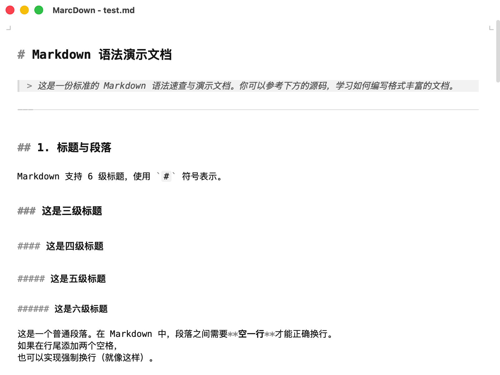
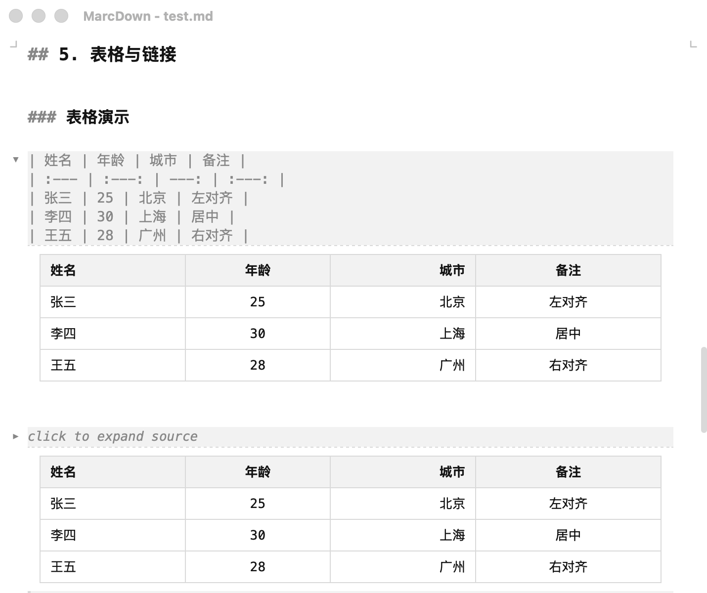

<p align="center">
  
</p>

<h1 align="center">MarcDown</h1>

<p align="center">
  一款轻量、上下分栏的 Markdown 编辑器
</p>

<p align="center">
  
  
  
</p>



## 功能特性

- **实时编辑** — 基于 satteri 的高性能 Markdown 编辑体验
- **文件管理** — 内置文件树，支持文件夹浏览和管理
- **大纲导航** — 自动提取标题结构，快速跳转
- **全局搜索** — 支持跨文件内容搜索
- **深色模式** — 跟随系统或手动切换主题
- **数学公式** — 支持 KaTeX 数学公式渲染
- **导出功能** — 支持导出为 HTML 等格式
- **文件关联** — 双击 `.md` 文件直接打开
- **文件监听** — 外部修改自动检测，冲突提示



## 技术栈

| 层级 | 技术 |
|------|------|
| 框架 | [Tauri 2](https://tauri.app/) |
| 前端 | React 19 + TypeScript |
| 编辑器 | 自研 |
| 状态管理 | Jotai |
| 构建工具 | Vite |
| 后端 | Rust |

## 快速开始

### 环境要求

- Node.js >= 18
- Rust >= 1.70
- [Tauri 环境配置](https://tauri.app/start/prerequisites/)

### 安装依赖

```bash
npm install
```

### 开发模式

```bash
# 仅前端开发（浏览器）
npm run dev

# 桌面应用开发（推荐）
npm run dev:pc
```

### 构建

```bash
# 构建 macOS dmg
npm run pack
```

## 项目结构

```
marc-down/
├── src/                  # 前端源码
│   ├── components/       # React 组件
│   │   ├── Editor/       # 编辑器组件
│   │   ├── Sidebar/      # 侧边栏/文件树
│   │   ├── Outline/      # 大纲面板
│   │   ├── Search/       # 搜索面板
│   │   ├── Layout/       # 布局组件
│   │   └── Settings/     # 设置
│   ├── hooks/            # 自定义 Hooks
│   ├── atoms/            # Jotai 状态
│   ├── services/         # 服务层
│   └── types/            # 类型定义
├── src-tauri/            # Rust 后端
│   └── src/commands/     # Tauri 命令
├── package.json
└── vite.config.ts
```

## License

[GPL-3.0](LICENSE)
