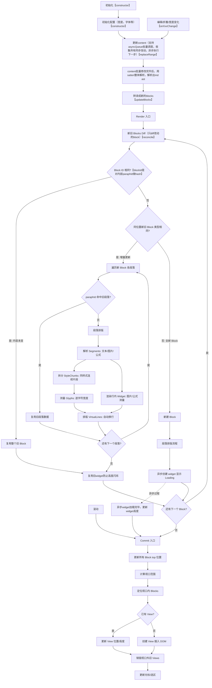

# 流程优化
* 首先设计流程图
* 其次文档解析由satteri完成
* 再其次一些无关紧要的优化

```mermaid
graph TD
    %% ===== 触发源 =====
    INIT[初始化【constructor】] --> CONFIG[初始化配置（宽度，字体等）【constructor】]
    CONFIG --> BUILD_DOC[更新content（支持asyncQueue批量调度，收集所有同步改动，异步执行下一步）【replaceRange】]
    BUILD_DOC --> MARK_DIRTY[content批量修改完毕后，用satteri整体解析，解析出md ast]
    EDIT[编辑/折叠/宽度变化【onXxxChange】] --> BUILD_DOC
    SCROLL[滚动] --> COMMIT

    %% ===== 段落切割 =====
    MARK_DIRTY --> SPLIT_DIRTY[转译成新的blocks【updateBlocks】]
    SPLIT_DIRTY --> RENDER[Render 入口]

    %% ===== Render: Reconcile 阶段 =====
    RENDER --> DIFF[新旧 Blocks Diff（只diff改动的block）【reconcile】]

    DIFF --> SAME_ID{Block ID 相同?【blockId是对内部paraphId做hash】}
    SAME_ID -->|是: 内容未变| REUSE_BLOCK[复用整个旧 Block]
    SAME_ID -->|否| SAME_TYPE{同位置新旧 Block 类型相同?}

    SAME_TYPE -->|是: 增量更新| PARA_LOOP[遍历新 Block 各段落]
    PARA_LOOP --> PARA_HIT{paraphId 命中旧段落?}
    PARA_HIT -->|是| REUSE_PARA[复用旧段落数据]
    PARA_HIT -->|否| NEW_PARA[段落排版]
    NEW_PARA --> PARSE_SEG[解析 Segments: 文本/图片/公式]
    REUSE_PARA --> PARA_NEXT{还有下一个段落?}
    PARA_NEXT -->|是| PARA_LOOP
    PARA_NEXT -->|否| PLACEHOLDER[复用旧widget防止高度闪烁]

    SAME_TYPE -->|否: 全新 Block| NEW_BLOCK[新建 Block]
    NEW_BLOCK --> LAYOUT_PARAPH[段落排版流程]
    LAYOUT_PARAPH --> ASYNC_LOADING[异步创建 widget 显示 Loading]

    %% ===== Block 解析子流程 =====
    PARSE_SEG --> PARSE_CHUNK[拆分 StyleChunks: 同样式连续片段]
    PARSE_CHUNK --> MEASURE_GLYPH[测量 Glyphs: 逐字符宽度]
    PARSE_SEG --> RENDER_WIDGET[渲染行内 Widget: 图片/公式测量]
    MEASURE_GLYPH --> LAYOUT
    RENDER_WIDGET --> LAYOUT[排版 VirtualLines: 自动换行]
    LAYOUT --> PARA_NEXT

    %% ===== 异步 Widget =====
    ASYNC_LOADING -.-> |异步过程|ASYNC_DONE[异步widget加载完毕，更新widget高度]
    ASYNC_DONE --> COMMIT

    %% ===== Reconcile 收尾 =====
    REUSE_BLOCK --> PLACEHOLDER
    PLACEHOLDER --> NEXT
    ASYNC_LOADING --> NEXT
    NEXT{还有下一个 Block?} -->|是| DIFF
    NEXT -->|否| COMMIT
    COMMIT[Commit 入口] --> UPDATE_TOP[更新所有 Block top 位置]

    %% ===== Commit 阶段 =====
    UPDATE_TOP --> VIEWPORT[计算视口范围]
    VIEWPORT --> FIND_VISIBLE[定位视口内 Blocks]
    FIND_VISIBLE --> HAS_VIEW{已有 View?}
    HAS_VIEW -->|是| UPDATE_POS[更新 View 位置/高度]
    HAS_VIEW -->|否| INSERT_VIEW[创建 View 插入 DOM]
    UPDATE_POS --> CLEANUP[销毁视口外旧 Views]
    INSERT_VIEW --> CLEANUP
    CLEANUP --> CURSOR[更新光标/选区]
```
