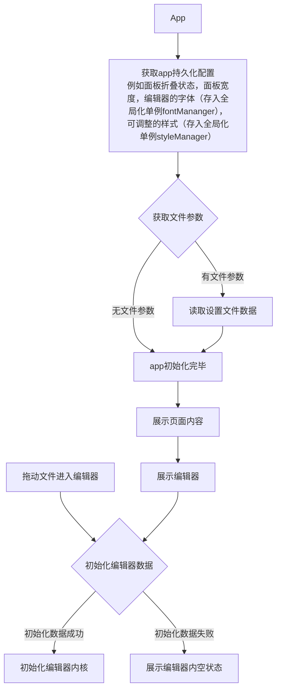

# App.tsx

## 作用

- 应用根组件，初始化全局 hooks。
- 水平排列侧边栏、编辑器、大纲三栏。

## 为什么这么实现

- `useOutline`、`useKeyboardShortcuts`、`useFileOpen` 放在顶层，因为它们是全局行为（大纲跟随活动文件变化、快捷键全局监听、文件打开事件处理），不属于任何子组件
- `DefaultAppToast` 放在 Layout 外层，因为它是全局浮层提示，不属于三栏布局结构

- 使用 flexbox 三栏布局，中间编辑器 `flex: 1` 自适应，两侧固定宽度
- 极简白色背景，无 border 分隔线，依靠内容本身的渐隐效果区分面板
- 侧边栏和大纲可折叠，通过 Jotai atom 控制显隐
- 展开/折叠按钮统一在编辑器区域通过 `position: absolute` 定位（左上角控制 sidebar，右上角控制 outline）
- 按钮使用 ChevronRight 图标 + rotate 旋转表示方向
- 大纲栏right=6表示右侧6px的编辑器滚动条留位置
- editor的左右padding是28px，因为展开折叠按钮的大小为28px，但右padding与大纲栏有关
    - 没有大纲栏时，右padding就是28px，滚动条是absolute悬浮在上面的，只有滚动时出现
    - 有大纲栏时，编辑器右padding为6px滚动条宽度+大纲栏宽度+28px
    - 大纲栏的宽度一定是 outlineWidth

## 状态持久化

- sidebar/outline 的展开收起状态使用 `atomWithStorage` 存储到 localStorage，刷新/重启后保持上次状态

## 面板拖拽

- 侧边栏宽度由 `sidebarWidthAtom` 驱动，通过 `PanelResizer` 组件拖拽调整
- 最小宽度 80px，低于 40px 阈值时自动折叠侧边栏
- 折叠后通过展开按钮恢复，恢复时使用默认宽度 150px
- 大纲栏宽度由 `outlineWidthAtom` 驱动，左侧有拖动线
- 大纲栏最小宽度 80px，低于 40px 阈值时自动折叠

## 滚动条布局

- 编辑器滚动条在窗口最右侧（大纲栏右边）
- 大纲栏通过 `position: absolute` 浮在编辑器区域右侧
- 编辑器内容通过动态 paddingRight 为大纲腾出空间，避免文字被遮挡

## 树状目录和大纲

- 左侧目录栏使用 lucide icon（ChevronRight/Down, Folder/FolderOpen, File）+ 缩进表示层级
- 右侧大纲栏右对齐，左侧透明渐隐，使用 ChevronRight/Down 展开/收起子标题

## 空状态

- 编辑器无文件打开时显示统一的 "Open" 按钮
- 点击后弹出系统文件对话框，同时支持选择文件和文件夹
- 选择文件夹时：设为工作区并展开目录侧边栏
- 选择文件时：直接在编辑区打开该文件
- 窗口标题栏格式为 `MarcDown - filename`（app 名在左，文件名在右）

