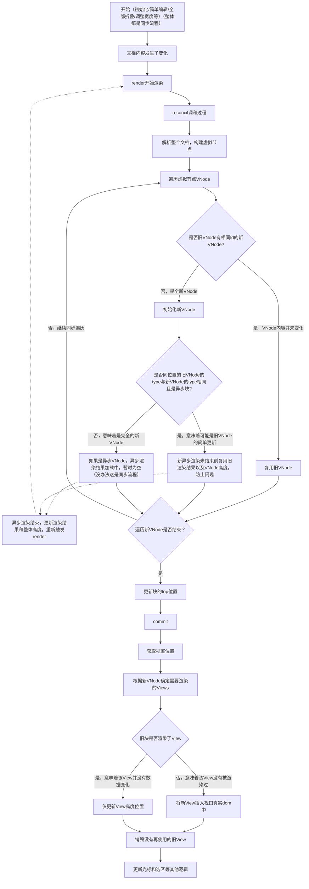
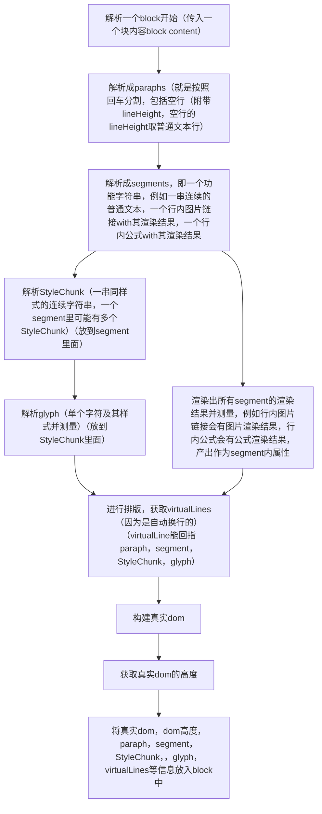

# EditorCore.ts

## 作用

- 编辑器主控类，统一管理所有子系统的生命周期和协调工作。
- EditorCore借鉴CodeMirror的逻辑交互

## 架构

```
EditorCore
  ├── Document     — 文档数据模型
  ├── History           — Undo/Redo 历史栈
  ├── SelectionManager  — 光标 + 选区管理
  ├── InputHandler      — 隐藏 textarea 输入捕获
  ├── MdRenderer     — 块级 DOM 渲染 + 坐标映射
  ├── VirtualScroller   — 虚拟滚动
  ├── FoldManager       — 折叠/展开
  └── EventHandlers     — 交互事件（链接、hover、右键菜单）
```

## DOM 结构

```
container (.native-editor)
  ├── scrollContainer (.native-editor-scroller)
  │     └── contentLayer (.native-editor-content)
  │           ├── selectionLayer — 选区高亮矩形
  │           ├── cursorEl — 闪烁光标
  │           ├── hidden textarea — 输入捕获
  │           └── [渲染的块级 DOM 元素]
  └── scrollbarEl (.native-editor-scrollbar) — 自定义滚动条（absolute 定位，不占宽度）
        └── scrollbarThumb (.native-editor-scrollbar-thumb)
```

## 公开 API

| 方法/属性 | 说明 |
|------|------|
| `init(content, fileKey)` | 设置文档内容，重置历史和选区 |
| `getContent()` | 获取当前文档文本 |
| `setPadding(left, right)` | 动态调整内容区 padding |
| `scrollToLine(lineNum)` | 跳转到指定行 |
| `focus()` | 聚焦编辑器 |
| `getEditorInstanceState()` | 获取当前编辑器实例的状态，例如滚动和选区状态（用于切换文件时缓存） |
| `restoreEditorInstanceState(state)` | 恢复滚动和选区状态 |
| `search(query, options)` | 执行搜索，返回匹配结果数组 |
| `navigateToMatch(match)` | 跳转到指定搜索匹配 |
| `replaceMatch(from, to, replacement)` | 替换单个匹配 |
| `replaceAll(query, replacement, options)` | 替换所有匹配 |
| `foldAll()` / `unfoldAll()` | 全部折叠/展开 |
| `destroy()` | 销毁编辑器，清理所有 DOM 和事件监听 |
| `onContentChange` | 回调属性，文档内容变更时触发，参数为最新文本 |

## 渲染流程

### 初始化流程 (`init`)

目标：减少白屏时间，先展示首屏再异步计算完整高度。

在useEffect这里调用initContent
```
init(content, fileKey)
  │
  ├── 同步阶段
  │     ├── doc.setContent(content) — 设置文档数据
  │     ├── history.clear() + selection.setSelection(0) — 重置状态
  │     ├── renderer.setBaseDir() — 设置资源路径
  │     ├── renderer.setContainerWidth() — 同步容器宽度
  │     ├── scroller.setScrollEnabled(false) — 禁止滚动
  │     ├── renderer.reconcile() — ★ 解析文档 + 高度复用/同步测量 + 计算 diffs
  │     │     → parseDocumentToBlocks() 解析全文得到 newBlocks
  │     │     → 高度复用：id 匹配的块复用旧高度
  │     │     → 同步测量：paragraph/heading/code 等纯文本块立即计算高度
  │     │     → diffBlocks(oldBlocks, newBlocks) 计算 add/remove/keep
  │     │     → startAsyncMeasure() 对 height==null 的块发起异步测量
  │     ├── getBlockHeights → setBlockHeights → computeVisibleRange
  │     ├── renderBlockRange(from, to, blockYs) — 渲染可见范围的块
  │     ├── scroller.setScrollEnabled(true)
  │     └── input.focus()
  │
  └── 异步阶段（自动触发）
        └── startAsyncMeasure() 完成后
              → setTimeout(0) → onAsyncMeasureComplete → scheduleRender()
              → 走完整 reconcile 流程（此时已有精确高度）
```

```
内容变更 → handleContentChanged()
  ├── scheduleRender() — requestAnimationFrame 去抖
  └── onContentChange?.(content) — 通知外部

scheduleRender() 的作用：如果每次都立即执行渲染（解析 block、计算高度、渲染 DOM、更新光标），
同一帧内会重复做多次昂贵的工作。requestAnimationFrame 把它们合并成下一帧只执行 1 次。

scheduleRender()
  → renderer.updateBlocks() — 同步：解析 + 高度复用 + 同步测量 + diff + 启动异步测量
  → getBlockHeights() — 收集所有块高度
  → scroller.setBlockHeights() — 更新虚拟滚动总高度
  → scroller.computeVisibleRange() — 计算可见块范围
  → renderer.renderBlockRange() — 渲染可见块 DOM（keep 块只更新 top，id 变化的块重建）
  → updateCursorVisual() — 更新光标和选区
  → updateScrollbar() — 更新自定义滚动条位置和尺寸
```

比较重要的流程：
* 首先构建一个全新的blockDatas（函数是updateBlockDatas），这里是全量解析，原谅我算法垃圾，但确实可能有更优秀的算法，这个可以看作React的虚拟树
* 其次旧blockDatas里的信息提取到新blockDatas，这里其实是在updateBlockDatas里，创建新blockData时顺带提取
  * 最重要的就是根据id比较，id是内容的hash，id不变意味着内容不变，旧blockData的信息都可以复用，例如高度，真实dom，渲染结果
    * 如果此时旧块没有数据或者说根本就没有旧块，那么就新建真实dom，根据是否异步渲染结果分别处理，同步记录高度，异步渲染成功后还要再次执行updateBlockDatas
  * 另外一个就是异步渲染的结果，例如下载的图片内容，mermaid渲染结果等，如果一个新块替代的旧块的type一样，那么就复用高度
    * 例如如果旧块是mermaid，新块也是mermaid，在新块未异步渲染完毕前，那么就复用旧块的渲染结果和高度，就是为了避免闪动
* 最后就是渲染，渲染是虚拟列表，只渲染视口区域（renderBlockViews）
  * 渲染列表这里的blockView是absolute的，高度位置可能受其他块影响，因此即便blockId没有改动，那么高度位置也需要全部重新设置
  * 视口肯定是由y轴坐标确定的像素范围，进而从新blockDatas里找到对应的blockViews，从而渲染出来
    * 但问题在于需要复用之前的blockViews
      * 如果在视口真实dom中的blockView不再使用了，例如id对不上已经没用了，那么需要销毁
      * 新blockData理论上在上一步updateBlockDatas里已经创建了，但是可能还没有插入视口真实dom中，这时候需要插入视口真实dom

* 对于高度测量，这里永远都只是同步测量，对于异步块，在异步渲染完成后会再次触发updateBlockDatas，然后重来一遍，这时候能获取到高度
## 鼠标交互

点击渲染层 → `getDocumentPosIndexAtCoords()` 计算文档位置 → 更新选区 → 拖动时更新 head → 释放完成选区

特殊点击处理优先级：
1. 复制按钮 / 语言选择器 / 任务复选框 → 阻止默认行为
2. EventHandlers 处理（链接点击、右键菜单等）
3. 常规文本选区操作（支持 Shift 扩展选区）

## 自定义滚动条

- absolute 定位在容器右侧，不占据文档宽度
- 仅在滚动时显示，停止后 1s 渐隐
- 支持拖拽 thumb 和点击 track 跳转
- 当文档高度 ≤ 视口高度时自动隐藏




